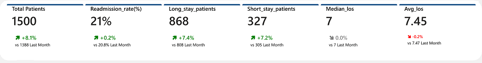

# Hospital Readmissions & Utilization Analytics

## Background and Overview
In a simulated LeonDab Hospitals scenario, leadership sought to better understand the drivers of 30-day patient readmissions and prolonged hospital stays in order to improve patient outcomes and operational efficiency. Leadership was particularly concerned about increasing bed occupancy pressures and inconsistent discharge outcomes across patient groups.

This project analyzes a dataset of **1,500 inpatient encounters**, focusing on length of stay (LOS), readmission rates, demographic factors, discharge practices, insurance categories, and primary diagnoses. The objective was to identify patterns associated with readmissions and extended hospitalizations and to present these findings through an interactive Power BI dashboard to support clinical and administrative decision-making.

The analysis defines **long stays as ≥7 days** and **short stays as <3 days**, enabling consistent tracking of hospitalization severity and resource utilization.

---

## Data Structure Overview
The dataset consists of **1,500 patient records**, with each row representing a unique hospital encounter. The data includes demographic information (age group and gender), clinical attributes (diagnosis category and comorbidity score), administrative variables (insurance type and discharge disposition), and time-based measures such as admission month and length of stay.

A dedicated date dimension table was created to support time-series analysis and monthly trend reporting. Derived fields were calculated to categorize LOS into short, and long stay groups and to compute key performance indicators such as readmission rate, average LOS, and patient distribution across clinical and demographic segments.

Relationships were modeled to enable cross-filtering across demographics, clinical drivers, and operational outcomes, ensuring that users could explore trends interactively across the dashboard pages.

### 🛠 Tools & Technologies
- MySQL (SQL Data Preparation)  
- Power BI (Data Modeling & Visualization)  
- DAX (Measures & Calculations)  
- Healthcare Analytics Framework  

---

## Executive Summary
The analysis found that the **overall readmission rate was approximately 16%**, representing about **240 readmitted patients** within 30 days. The **average length of stay was 7.45 days**, with a **median LOS of 7 days**, indicating that most patients experienced moderately extended hospitalizations.

Long stays were a dominant pattern in the dataset, accounting for **868 patients (57.87%)**. Readmission rates varied by diagnosis, with **Heart Failure and Hypertension showing the highest rate at approximately 17%**, followed by **Diabetes at 16%**, **Kidney disease and COPD were pegged at 14% respectively**. Demographic analysis indicated increasing readmission risk with older age groups, while gender differences were relatively balanced across most measures.

Operationally, discharge disposition emerged as an important factor, as non-routine discharges were associated with higher readmission likelihood compared to routine home discharges.

---

## 📷 Dashboard Preview

---

## Insights Deep Dive
Length of stay distribution showed that **868 patients (57.87%) experienced long stays**, indicating a strong skew toward prolonged hospitalization. Patients aged **30-44 accounted for the largest share of long-stay admissions**, averaging LOS values approximately **1.4–1.8 days longer** than younger cohorts.

Clinical complexity increased alongside hospitalization duration. The scatter analysis indicated a **very weak relationship** between comorbidity score and length of stay (correlation ≈ **0.02**). Male and female patients showed nearly identical averages (≈ **2.6** comorbidity score and **~7.5–7.6 days** LOS), suggesting that comorbidity level alone was **not a strong predictor** of prolonged hospitalization in this dataset.

Diagnosis-level analysis demonstrated clear readmission variation. **Heart Failure and Hypertention patients recorded a readmission rate of about 17%**, translating to roughly **1 in every 6 encounters**, while **Diabetes (approximately 16%)** is almost at par with the dataset’s overall average of **16%**. Lower-risk diagnosis groups remained closer to **14%**, suggesting targeted intervention opportunities.

Gender comparisons revealed relatively balanced readmission outcomes, with male and female rates differing by less than **2 percentage points**, indicating that demographic sex differences alone were not a primary driver of readmission risk.

Insurance analysis showed only modest variability, with readmission rates across payer categories typically falling within a **3–4 percentage point range**, reinforcing that clinical factors outweighed financial coverage differences in determining outcomes.

Discharge disposition displayed one of the strongest operational signals. Patients discharged to non-home care settings demonstrated readmission rates approximately **6–8 percentage points higher** than routine home discharges, suggesting that transitional care processes and post-discharge monitoring represent critical intervention points.

Monthly patient volumes ranged within a relatively stable band, with fluctuations generally staying within **±10% of average monthly admissions**, indicating consistent hospital utilization rather than seasonal spikes. LOS frequency peaked within the **6–10 day range**, aligning with the high proportion of long-stay encounters.

---

## Recommendations
Hospitals should prioritize targeted discharge planning for high-risk diagnoses such as **Heart Failure, Hypertension, and Diabetes**, as these categories consistently exhibit elevated readmission rates. Structured follow-up programs and patient education initiatives may help reduce preventable returns to the hospital.

Clinical teams should implement early risk stratification for patients projected to exceed seven days of hospitalization, as long-stay patients represent almost **60% of encounters** and contribute significantly to bed utilization pressures.

Care coordinators should review discharge workflows, particularly for non-routine discharge types, to ensure adequate post-discharge support and continuity of care. Strengthening communication between inpatient teams and outpatient providers may reduce avoidable readmissions.

Lastly, continued monitoring of demographic trends and comorbidity patterns is recommended to identify vulnerable patient populations early and to guide resource allocation toward preventive interventions.

---

## 👤 Author
Pantaleon Akujobi  
Healthcare & Data Analytics Projects

