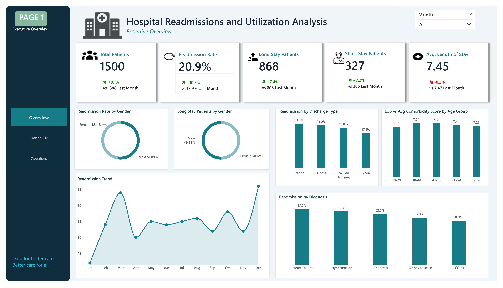
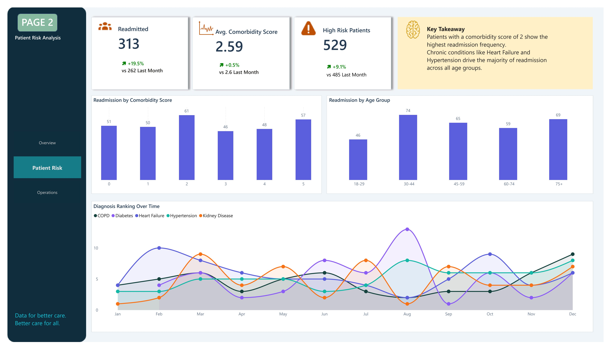
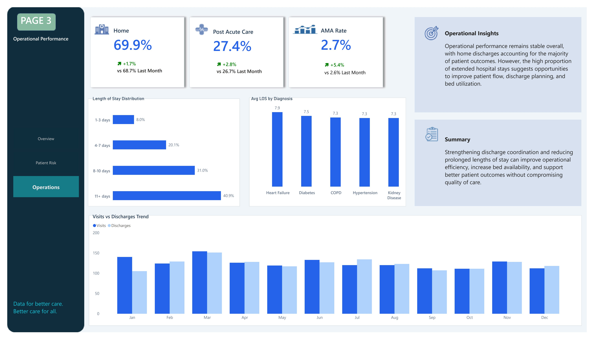

# Hospital Readmissions & Utilization Analytics

## Background & Overview

Hospital readmissions remain one of the most important indicators of healthcare quality, patient outcomes, and operational efficiency. High readmission rates increase treatment costs, reduce bed availability, and often indicate opportunities to improve discharge planning and post-acute care.

This project presents an interactive Hospital Readmissions & Utilization Analytics Dashboard developed in SQL and Power BI to help healthcare administrators monitor patient outcomes, identify high-risk populations, and evaluate operational performance.

The solution combines patient demographics, diagnoses, discharge information, comorbidity scores, and hospital utilization metrics into a three-page executive dashboard that supports evidence-based decision-making across patient care and hospital operations.

---

## Dashboard Preview

### Executive Overview

### Patient Risk Analysis

### Operational Performance

---

## Data Structure Overview

The dashboard was developed using a hospital admissions dataset containing patient-level information across clinical and operational dimensions.

The dataset includes information such as:

- Patient demographics
- Admission and discharge dates
- Readmission status
- Diagnosis categories
- Comorbidity scores
- Length of stay
- Discharge destination
- Monthly hospital activity

The data model was designed to support flexible analysis across multiple healthcare perspectives while maintaining efficient filtering and reporting.

---

## Technical Stack

### Tools

- SQL
- Power BI Desktop
- Power Query
- DAX

### Power BI Development Techniques

- Star Schema Data Modeling
- Time Intelligence using Date Tables
- `USERELATIONSHIP()` for activating multiple date relationships within measures
- Interactive Slicers
- KPI Cards
- Custom Executive Insight Panels
- Drill-down Visualizations
- Conditional Formatting

---

## Executive Summary

The dashboard reveals that hospital utilization remains relatively stable, with a 20.9% readmission rate across the reporting period. While patient volume continues to increase, prolonged hospital stays remain a significant operational concern, particularly among patients diagnosed with chronic conditions such as Heart Failure and Hypertension.

The analysis highlights opportunities to improve discharge planning, reduce extended admissions, and strengthen post-acute care pathways. Readmission rates vary across discharge destinations and diagnosis groups, suggesting that targeted interventions could improve both patient outcomes and hospital efficiency.

Operational metrics further indicate that home discharge remains the dominant discharge pathway, while extended length of stay continues to consume a substantial proportion of hospital resources.

---

## Insights Deep Dive

### 1. Readmission Rate Remains Clinically Significant

The overall readmission rate stands at 20.9%, representing approximately one in every five patients returning for additional care.

Although patient admissions continue to grow, reducing preventable readmissions presents a major opportunity for improving quality of care while lowering healthcare costs.

### 2. Long Hospital Stays Drive Resource Utilization

Long-stay patients account for 868 admissions, considerably exceeding the number of short-stay patients.

The operational dashboard further shows that 40.9% of patients remain hospitalized for more than eleven days, indicating substantial bed occupancy and increased demand on hospital resources.

### 3. Chronic Diseases Account for Most Readmissions

Heart Failure records the highest readmission rate (23.2%), followed closely by Hypertension (22.3%) and Diabetes (21.2%).

These findings reinforce the importance of chronic disease management programs aimed at reducing avoidable hospital returns.

### 4. Comorbidity Increases Readmission Risk

Patients with a comorbidity score of 2 recorded the highest number of readmissions.

Higher comorbidity burden appears strongly associated with increased readmission frequency, suggesting that risk-based care management could improve outcomes.

### 5. Home Discharge Represents the Largest Patient Group

Approximately 69.9% of patients were discharged home, making it the most common discharge destination.

Monitoring post-discharge outcomes for this population may help reduce subsequent readmissions through improved follow-up care.

### 6. Post-Acute Care Accounts for More Than One Quarter of Discharges

27.4% of patients transitioned into post-acute care facilities following discharge.

This highlights the important role that rehabilitation and transitional care services play in supporting recovery after hospitalization.

### 7. Length of Stay Varies Across Diagnosis Groups

Heart Failure patients recorded the highest average length of stay (7.9 days), while COPD, Hypertension, and Kidney Disease averaged approximately 7.3 days.

Longer admissions among chronic disease patients suggest opportunities to improve care coordination and discharge planning.

### 8. Monthly Activity Indicates Stable Operational Demand

Hospital visits and patient discharges remained relatively consistent throughout the year, indicating stable operational demand.

However, sustained long lengths of stay may still constrain bed availability despite relatively balanced admission and discharge volumes.

---

## Recommendations

### Strengthen Readmission Prevention Programs

Develop targeted interventions for high-risk patients with chronic conditions such as Heart Failure, Hypertension, and Diabetes through improved discharge education and follow-up care.

### Improve Care Coordination

Enhance collaboration between inpatient teams, rehabilitation services, and primary care providers to reduce preventable readmissions.

### Prioritize High-Risk Patients

Use comorbidity scores and diagnosis history to identify patients requiring enhanced monitoring after discharge.

### Reduce Length of Stay

Review clinical workflows and discharge planning processes to safely reduce prolonged hospital admissions while maintaining quality of care.

### Expand Post-Discharge Monitoring

Implement structured follow-up programs for patients discharged home to improve medication adherence, recovery, and early identification of complications.

### Optimize Hospital Resource Allocation

Monitor utilization trends to improve bed management, staffing decisions, and operational planning during periods of increased demand.

---

## Key Takeaways

- Overall readmission rate reached 20.9%.
- Approximately 40.9% of patients remained hospitalized for more than 11 days.
- Heart Failure recorded the highest readmission rate among diagnosis groups.
- Patients with a comorbidity score of 2 experienced the greatest readmission frequency.
- Home discharge represented the majority of discharge outcomes.
- Hospital activity remained operationally stable throughout the reporting period.
- Improving discharge planning and chronic disease management offers the greatest opportunity to reduce readmissions and improve hospital efficiency.
